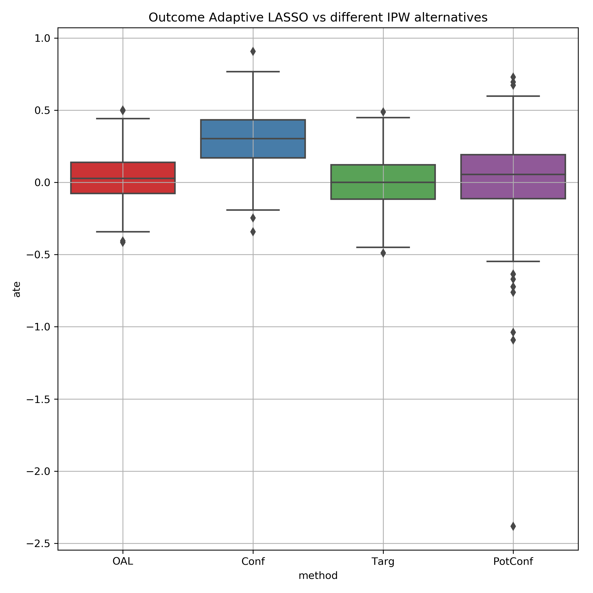

# Outcome Adaptive LASSO
This repository contains a Python implementation of the paper [Outcome-Adaptive Lasso: Variable Selection for Causal Inference](https://www.ncbi.nlm.nih.gov/pmc/articles/PMC5591052/pdf/nihms-852754.pdf) (*Shortreed and Ertefaie, 2017*)

The code is also posted on [PapersWithCode](https://paperswithcode.com/paper/outcome-adaptive-lasso-variable-selection-for)

## Usage
1. To use the outcome adaptive lasso with a synthetic dataset like demonstrated in the paper, use the following example:
```python
from outcome_adaptive_lasso import calc_outcome_adaptive_lasso, generate_synthetic_dataset
df = generate_synthetic_dataset(n=200, d=100, rho=0, eta=0, scenario_num=4)
ate = calc_outcome_adaptive_lasso(df['A'], df['Y'], df[[col for col in df if col.startswith('X')]])
```

2. To use it on your dataset, pass it in as a dataframe just like above

> `compare_oal_ipw.py` is a script to reproduce some of the figures in the paper, comparing the outcome adaptive lasso to plain IPW based estimation. It includes a replication of figure 1 from the supplementary material, using scenario 4 of the synthetic dataset with 200 samples, 100 covariates and no correlation between covariates:


logo created by [Ragal Kartidev](https://thenounproject.com/search/?q=lasso&i=3411314) from Noun Project
